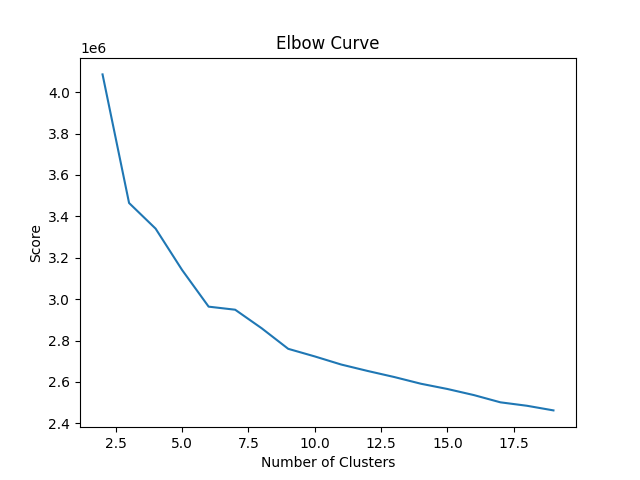

## Setting up the environment
```
pip install -r requirements.txt
python -m spacy download en_core_web_sm
```

## (Optional) Creating a chunked dataset from the large JSON file. The data source is https://www.aminer.org/citation, version 13.
```
python preprocess_research_data.py <path_to_json>
```
## Tokenizing the dataset with Word2Vec (from now on, it is expected that you work in an HPC cluster environment)
```
sbatch tokenize_articles.sh
```

The outcome of this script is a saved `w2v_tokenized` dataset, as well as a trained `word2vec` model checkpoint.
Please refer to the `slurm-41729422.out` for detailed logs on the successful run of the script.

## Fitting the KMeans and determining the number of clusters.
```
sbatch determine_clusters.sh
```

The result of the script is a range of fitted KMeans model checkpoints for different values of `k` (from 2 to 19 with step of 1). Based on the sum of squared distances metric, we use an elbow method to determine an optimal number of clusters. The `slurm-41781473.out` file contains the logs for the successful run of the script. The plot below is generated in the same run:


From the plot, we select the KMeans model with `k=8` as the final clustering baseline.

## Search engine
```
python search_engine.py './w2v_tokenized' "instability of linear switched systems" 5
```

This script will tokenize your article title, extract features with trained word2vec, and compute the cosine similarity with all the record in the database. Top `N` results are saved in the final `csv` file. Please refer to the `search1682246453.5952318` for the results of above example.
